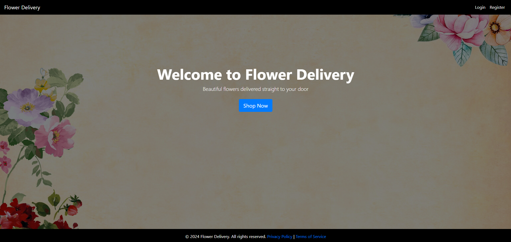
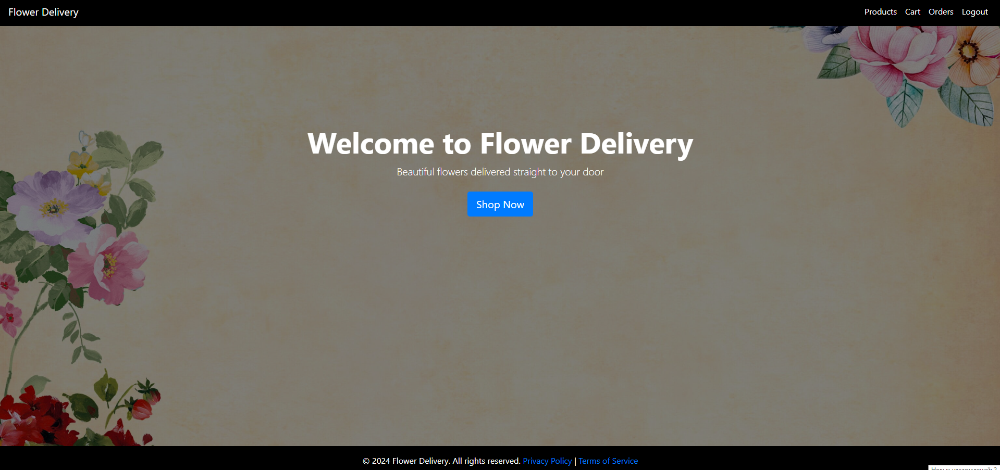
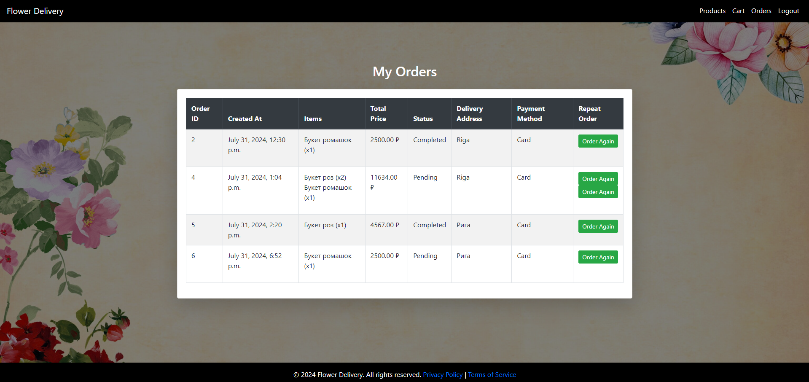
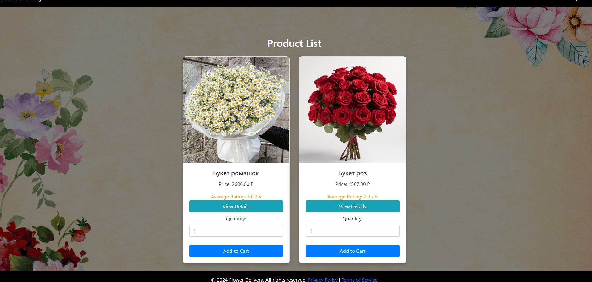
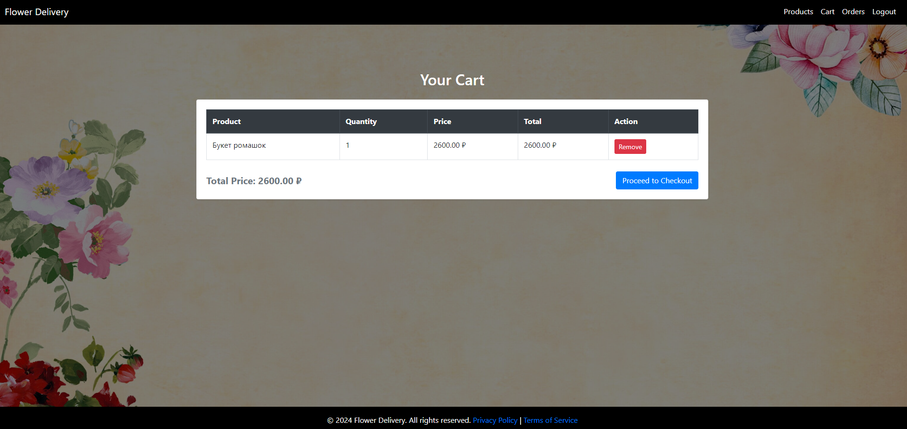

## 🌸 Flower Delivery Service
## 🌼 Цель проекта 
Создание удобного веб-сайта и Telegram бота для заказа доставки цветов. Пользователи могут легко выбирать и заказывать букеты через веб-сайт, а также управлять заказами с помощью Telegram бота.

## 📖 Общая информация о проекте
Проект включает разработку веб-сайта для заказа цветов и мощного Telegram бота для приёма и управления заказами. Решение направлено на создание простого и удобного способа покупки и доставки цветов как для частных лиц, так и для компаний.

## 🛠️ Область применения
Описание проблемы
Современным пользователям необходим удобный и быстрый способ заказа цветов через интернет и мессенджер. Наш проект решает эту задачу, предоставляя простой и эффективный инструмент для оформления заказов.

Пользователи системы
Частные лица, желающие заказать цветы для личных нужд.
Компании, нуждающиеся в услугах доставки цветов.
Основные ограничения и допущения
Пользователи должны иметь доступ к интернету и Telegram.
Заказы принимаются и обрабатываются только в рабочее время.
## 🎯 Функциональные требования
Веб-сайт
Регистрация и авторизация пользователей

Возможность создать учетную запись и входить в систему.
Просмотр каталога цветов

Ознакомление с доступными букетами и цветочными композициями.
Выбор цветов и добавление в корзину

Пользователи могут выбирать товары и добавлять их в корзину.
Оформление заказа

Ввод данных для доставки и подтверждение заказа.
Просмотр истории заказов

Возможность просмотра всех предыдущих заказов.
Аккаунт администратора

Управление статусом заказов и взаимодействие с клиентами.
Возможность повторного заказа

Легкое повторение заказа той же позиции из каталога.
Поддержка отзывов и рейтингов

Пользователи могут оставлять отзывы и оценки о цветочных композициях и сервисе.
Telegram бот
Получение заказов

Прием информации о заказах, включая детали букета и данные для доставки.
Уведомления о статусе заказа

Оповещение клиентов о статусе их заказа (обработан, в пути, доставлен).
## 🏗️ Общая архитектура системы
Веб-приложение: Разработано с использованием фреймворка Django.
Серверная часть: Бэкенд на Python с использованием Django.
Описание подсистем и модулей
Модуль регистрации и авторизации

Управление учетными записями пользователей.
Модуль каталога товаров

Обработка и отображение информации о цветочных композициях.
Модуль оформления заказа

Процесс оформления и подтверждения заказов.
Модуль управления заказами

Инструменты для администраторов по управлению заказами и их статусами.
Модуль отзывов и рейтингов

Функциональность для оставления и управления отзывами и рейтингами.
### Мы стремимся сделать процесс заказа цветов максимально удобным и приятным для наших пользователей, обеспечивая качественное обслуживание и поддержку через современные веб-технологии и мессенджеры.

  
  

## Пароль для теста:
### Login : chemi  
### Password : chemi123
# Скрины проекта:

